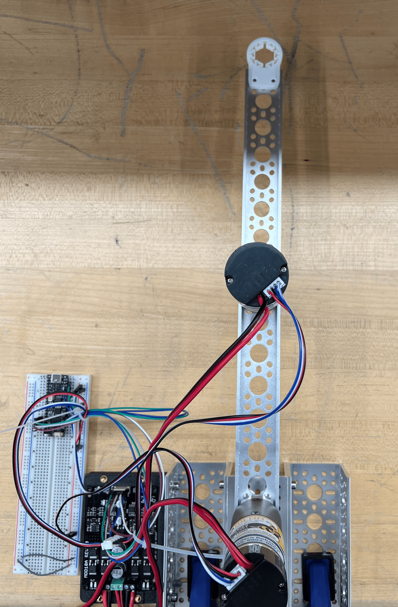
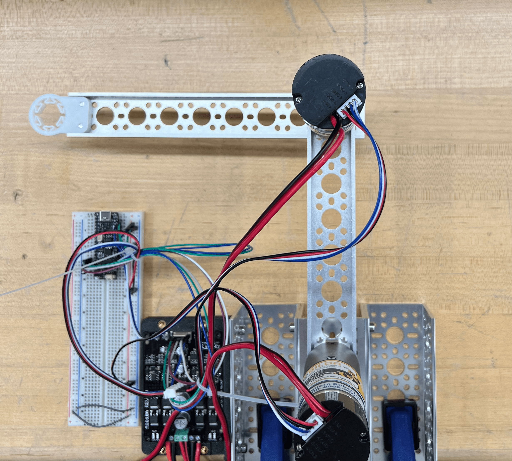

# Lab 3: 2-DoF Robot Pt.2

2.12/2.120 Intro to Robotics  
Spring 2024[^1]

- [1 Validate Hardware Setup](#1-validate-hardware-setup)
  - [1.1 Validate Encoders](#11-validate-encoders)
  - [1.2 Validate Motors](#12-validate-motors)
  - [1.3 Validate Joystick](#13-validate-joystick)
- [2 Validate Serial Read](#2-validate-serial-read)
- [3 Step Response in Joint Space](#3-step-response-in-joint-space)
  - [3.1 Straight Arm](#31-straight-arm)
  - [3.2 Bent Elbow](#32-bent-elbow)
- [4 Forward Kinematics](#4-forward-kinematics)
- [5 Inverse Kinematics](#5-inverse-kinematics)
- [6 Cartesian Space](#6-cartesian-space)
  - [6.1 Horizontal Line](#61-horizontal-line)
  - [6.2 Vertical](#62-vertical)
  - [6.3 Joystick](#63-joystick)
- [7 Feedback Form](#7-feedback-form)

## 1 Validate Hardware Setup
Estimated time of completion: 10 min

Before beginning any work with hardware, it's important to make sure all of it works! Faulty wiring or hardware is often a simple bug, but can be very difficult to find with a lot of moving parts in software.

### 1.1 Validate Encoders
Run `test_code/encoder_test.cpp` to validate your encoder setup. Remember to open the Serial Monitor to see the output. Make sure that both the direction and the magnitude make sense!

### 1.2 Validate Motors
Run `test_code/motor_drive_test.cpp` to validate your motor setup. You should see both motors oscillating back and forth. Remember that motor 1 is attached to the base (acts like a shoulder), and motor 2 is attached to the second link (acts like an elbow). Make sure that the motor power is turned off any time you are uploading code to your microcontroller.

### 1.3 Validate Joystick
Run `lab_code/joystick.cpp` and `test_code/joystick_test.cpp` to validate your joystick setup. You should be able to see joystick readings within the range `[0, 4096)`.

## 2 Validate Serial Read
Estimated time of completion: 10 min

- open `src/matlab/serialRead.m` in MATLAB
- set Serial port (lines 28-29)
- run
- make sure Serial monitor is closed

## 3 Step Response in Joint Space
Estimated time of completion: 20 min

### 3.1 Straight Arm
Set the arm to be straight forward:

Run `lab_code/step_response.cpp`.

If your controller is properly tuned (which it should be already!), the step response should have minimal overshoot, oscillations, and steady state error. 

Take a screenshot of the SerialRead.

### 3.2 Bent Elbow
Set the arm to be bent 90 degrees at the elbow:

Run `lab_code/step_response.cpp` again.

Take a screenshot of the SerialRead.

| :white_check_mark: CHECKOFF X :white_check_mark:   |
|:---------------------------------------------------|
| Identify and explain any differences in the step response between the straight arm and bent arm configurations. |

## 4 Forward Kinematics
Estimated time of completion: 10 min

First, derive the forward kinematic equations for a 2-DoF arm. In other words, derive equations for `x` and `y` in terms of <code>Θ1</code> and <code>Θ2</code>.

<i> What is forward kinematics? </i>

Forward kinematics answers the question, "Given the angles of the robot's joints, what are the x, y coordinates of the robot's hand?" For more, refer to lecture 2!

To validate your derived equations, first move your robotic arm to the angles `(pi/2, 0)` (pointing straight forward). Then, run `lab_code/kinematics.cpp` and `test_code/forward_kinematics_test.cpp`. You should see the Serial Monitor printing the `x` and `y` real-life coordinates of the marker holder in centimeters (e.g. at the angle `(pi/2, 0)`, `x=0` and `y~=38`).

## 5 Inverse Kinematics
Estimated time of completion: 10 min

Using the forward kinematic equations you found, derive the inverse kinematic equations for a 2-DoF arm. In other words, derive equations for <code>Θ1</code> and <code>Θ2</code> in terms of `x` and `y`.

<i> What is inverse kinematics? </i>

It's the opposite of forward kinematics!
Put simply, forward inverse kinematics answers the question, "Given the desired x,y coordinates of the robot's hand, what should the angles of the robot's joints be?" For more, refer to lecture 2!

Then, translate your derived equations into code by completing the `TODO 2`s in `kinematics.cpp`.

To validate your derived equations, run `lab_code/kinematics.cpp` and `test_code/inverse_kinematics_test.cpp`. You should see `theta1_error` and `theta2_error` be 0.

## 6 Cartesian Space
Estimated time of completion: 10 min

Now that we tuned our PID controller and implemented inverse kinematics, we can follow any trajectory we want in Cartesian space!

### 6.1 Horizontal Line
Set the setpoint to be a horizontal line in Cartesian space.

### 6.2 Vertical 
Set the setpoint to be a vertical line in Cartesian space.

### 6.3 Joystick
Set the setpoint to be the reading from your joystick.

| :white_check_mark: CHECKOFF X :white_check_mark:   |
|:---------------------------------------------------|
| Demonstrate the arm following your joystick. |

## 7 Feedback Form

Before you leave, please fill out https://tinyurl.com/212-feedback. 

| :white_check_mark: CHECKOFF X :white_check_mark:   |
|:---------------------------------------------------|
| Show the feedback form completion screen to a TA or LA. |

[^1]: Version 1 - 2024: Jinger Chong, Josh Sohn
